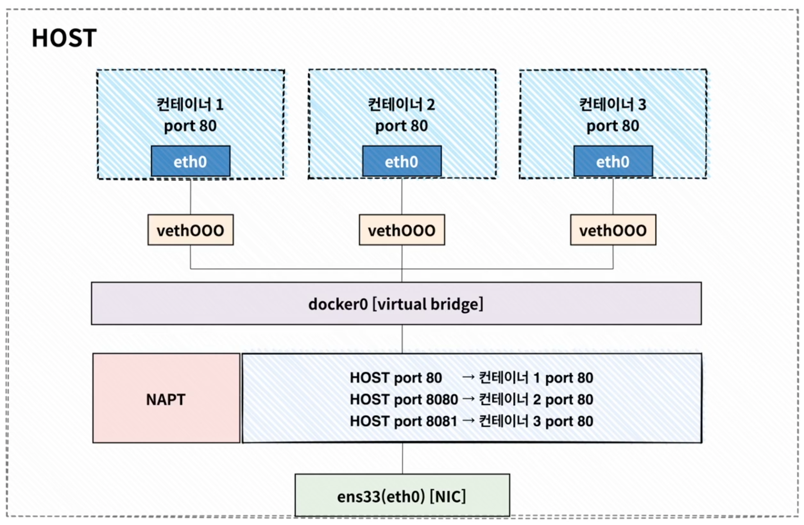
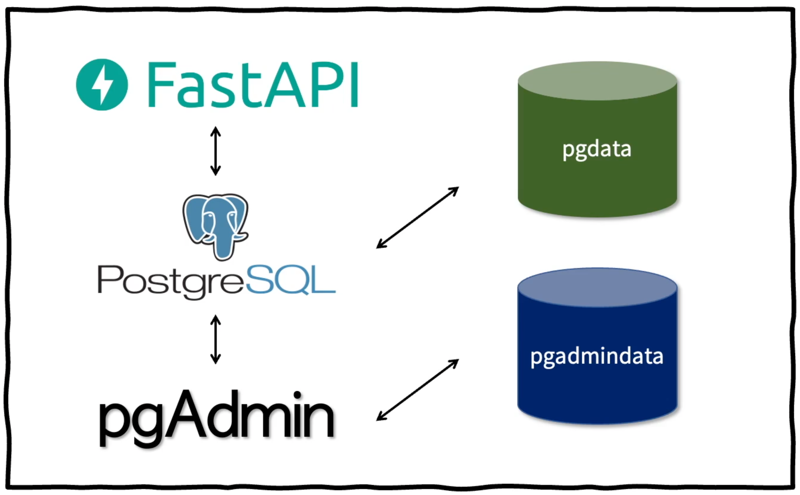
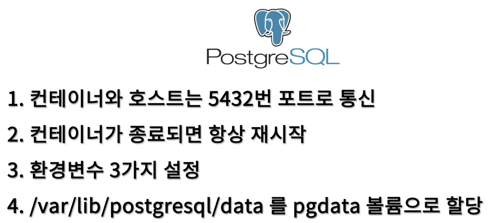
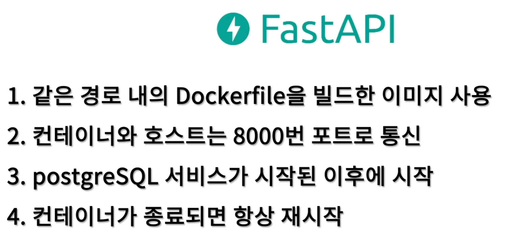

# 두번째 과제

## 실행법

```sh
docker-compose up
```

### pgAdmin

- `http://localhost:5050/` 를 브라우저로 접속
- 아이디에 `admin@example.com`, 비밀번호를 `admin` 으로 로그인

#### postgreSQL

- 브라우저로 접속한 pgAdmin 에서 "Add New Server" 를 클릭해서 DB Connection 을 시도
  - Host name/address: localhost 로 하면 연결이 안됨. ifconfig 를 통해 라우터가 제공하는 ip 주소를 알아내야함 (192 혹은 172로 시작)
  - Port: 5432
  - Maintenance database: postgres
  - Username: postgres
  - Password: postgres

### FastAPI

- `http://localhost:8000/docs` 를 브라우저로 접속
- API 가 정상 동작하는지 이것저것 클릭해보기 (Swagger 랑 사용법 비슷)

# 과제 조건

- 제출 기한
  - 2021.10.1(금) 24:00 (10/2로 넘어가는 자정)
- 제출 방법
  - Github Gist 링크를 Form에 작성하여 제출
  - Github Gist 생성 시, Create secret gist 로 생성
- 제출 링크
  - [도커 기초] 과제 2
- 과제 템플릿
  - https://github.com/ggingmin/FastAPI-sample-app
- 채점 방법
  - docker-compose.yml 파일이 요건에 맞게 작성되었는지 확인
  - docker-compose.yml 이외에 제공해드린 템플릿 소스의 변경이 없는 상태에서 `sudo docker-compose up` 명령어 수행 시 정상적으로 컨테이너가 모두 실행되는지 확인
  - 모든 조건을 만족해야 통과 처리 됩니다.

# 수행 조건

# Network



# Volume



## postgreSQL(db)

1. 컨테이너와 호스트는 각각 5432 포트로 통신
2. 컨테이너가 종료되면 항상 재시작
3. 환경변수 3가지 설정
    - POSTGRES_USER=postgres
    - POSTGRES_PASSWORD=postgres
    - POSTGRES_DB=postgres
4. /var/lib/postgresql/data 를 pgdata 볼륨으로 할당



## pgAdmin(pgadmin)

1. 컨테이너의 5050 포트와 호스트의 80 포트 연결
2. 컨테이너가 종료되면 항상 재시작
3. 환경변수 2가지 설정
    - PGADMIN_DEFAULT_EMAIL=admin@example.com
    - PGADMIN_DEFAULT_PASSWORD=admin
4. /var/lib/pgadmin 를 pgadmindata 볼륨으로 할당


## FastAPI(web)

1. 템플릿으로 제공된 Dockerfile 을 빌드한 이미지 사용
2. 컨테이너와 호스트는 각각 8000 포트로 통신
3. postgreSQL(db) 서비스가 시작된 이후에 시작
4. 컨테이너가 종료되면 항상 재시작


